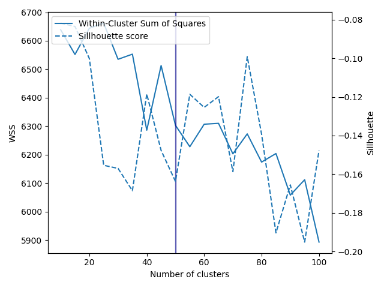

In our daily lives, we naturally categorize everything we encounter, including the characters in the movies we love. The characters that capture our collective imagination often mirror our aspirations, fears, and evolving values. Although every movie is unique, we still can notice that there are often protagonists and antagonists; the main character and her/his beloved, and many many more patterns.

So we invite you on a journey to reveal archetypes of movie characters, to uncover insights into people's preferences for character traits. 
We hope everyone will discover something interesting here: movie historians will see global trends; geographers will obtain a perspective of the cultural preferences of every country; filmmakers will learn the characters they need for success; psychologists will create a portrait of modern human and their desires and Potterheads will be mad to know why Draco and Harry ended up in the same cluster. 

Still not interested? Give us a chance by looking at the visuals and allow us to entertain you for the next couple of minutes.

## Characters clustering
Clustering is a crucial step in our analysis. 
 We follow the idea suggested in the paper [Learning Latent Personas of Film Characters](https://developer.imdb.com/non-commercial-datasets/) to extract information about character archetypes from the plot text. We implement two methods: Latent Dirichlet Allocation (LDA)-based and BERT-based clustering.

Latent Dirichlet Allocation-based clustering:
- extract linguistic features for each character using `spacy`
- use word2vec embeddings to cluster these features into topics using Agglomerative Clustering,
- perform Latent Dirichlet Allocation to cluster characters based on their feature topics.

BERT-based clustering:
- obtain the character's embedding from the pre-trained BERT model
- perform clustering (Agglomerative or KMeans) using these embeddings.

So the LDA method first extracts linguistic features and then finds word2vec embeddings for them as soon as BERT-based clustering directly obtains the character's embedding. Thus, LDA is a more explainable method because we know the attributes of every cluster.

We compared our clustering methods with those proposed in the paper. Our methods performed better based on the Variation of Information between learned clusters and between gold clusters extracted from TV Tropes. As the BERT-based method didn't significantly outperform the LDA-based one, we chose LDA for our analysis due to its speed advantage and explainability.

After that, we fix the clustering algorithm and search for the best number of clusters for our later analysis using the Within-Cluster Sum of Squares: 

As a result, we derived 50 archetypes. You can look at the topics with the highest probabilities for each archetype:



And some examples of characters with particular archetypes:

| Character |                                         Film     |Archetype(cluster)|
|-----------|--------------------------------------------------|------------------|
|Dumbledore |  Harry Potter and the Goblet of Fire, Harry Potter and the Half-Blood Prince|  13|
|   Gandalf |             The Lord of the Rings: The Two Towers|                13|
|   Gandalf | The Lord of the Rings: The Fellowship of the Ring|                25|
|     Harry |     Harry Potter and the Deathly Hallows – Part 2|                25|
|    Gollum |     The Lord of the Rings: The Return of the King|                39|
| Voldemort |         Harry Potter and the Order of the Phoenix|                46|
| Bellatrix |          Harry Potter and the Half-Blood Prince  |                46|

We can see, that the clusters obtained with our method group characters with similar roles in their movies (sometimes this leads to one character being in different clusters, e.g. having a different role in different parts of the story).

## Historical trends
To prove our clustering works, let's experiment with a history. Our world is constantly changing, but do our favourite characters?

Take a look at the past to find what people used to like and compare to what they like now.

## Cultural preferences
Hollywood stands as the central hub and Mecca of the film industry. Although various countries create films with a primary focus on their local audience, delving into these productions adds an extra layer of interest. To either prove or refute stereotypes, we examine cultures from a different perspective and assess our archetypes based on the country of film production.

Several countries contribute to the film industry, and our focus is exclusively on the leading countries in film production. We've determined the top 10 countries based on character count and plotted their standing in film production through a chart. 

<strong>Total Character Count by Country</strong>

The chart indicates that character count is notably higher for American films. To standardize the data, we conduct normalization. Subsequently, we will analyze the distribution of the top five global archetypes.

The distribution of the top 5 clusters in top 10 countries in the 21st century brings about notable differences between the countries. There are observable trends or patterns in the types of characters that are popular as protagonists in movies from different cultural contexts or countries. For example, there are comparable differences in India and Hong Kong compared to the United Kingdom and Spain. In the first group, protagonists are portrayed as proactive, taking decisive actions, and accomplishing significant goals or feats. While in the second group, protagonists are portrayed as traveling, suggesting themes of exploration, cultural exchange, or transformative journeys.

Presently, we are unable to fully assert that the distribution of archetypes varies among different countries. However, was this the case in the 20th century?

Observing the plot developments throughout the 20th century, a discernible shift is intriguingly noted: a transformation from a more achieving to communicating protagonists.

##  Movie success
Now that we have explored both differences and similarities, is it possible to predict the success of the movies based on the characters who are involved?
We are interested to determine if the architypes do play a significant role in the success of the movie. By analyzing the log revenue distribution, we can construct a linear model to identify the most significant archetypes by examining the coefficients and p-values. 

First, we will take a look at the number of movies with revenue data and also log revenue histogram. In this part of analysis, we simply use revenue data for measuring success.

The effect of the interactions between the architypes and its effects to the movie success was studied. We compare the impact of archetype interactions on movie success by evaluating two models—one with interaction terms and one without. This allows us to analyze if the interaction term contributes to explaining the variability of the movie success. Subsequently, we fitted a linear regression model to both models to examine the relationships. R-squared metric was 0.093 for the model without interaction terms and 0.261 for the model with interaction tems.Those values are small and we cannot predict the success from arechetypes themselves but we can say that interactions between archetypes is important for movie success considering the fact R-squared metric increased a lot.
 

## Actors success
The same goes for actors - we know that it is possible to become famous by playing in the first or secondary roles, villains or good-natured people, strong-willed leaders or decent citizens, but who has *statistically* more chances?

<h3> Measurement of success</h3>
We were conflicted about how to measure the success of the actors, whether to use their average ratings or normalized revenue. By plotting the histogram chart between the two metric and calculating the Pearson correlation coefficient, we noticed certain correlation between the average ratings and normalized revenue. In order to measure the success of an actor, we decided to combine both metrics and use the sum of normalized log revenue and rating of the film as the metric for success.

\
<strong>Distribution of Normalized Log Revenue and Average Rating</strong>

We are interested in figuring out who are the top actors that in the film industry. To assess the success of actors, we established specific criteria to determine the significance of each actor. 

Firstly, actors were assigned varying levels of importance based on their roles in different movies. We determined the importance of each actor by analyzing plot summaries and counting the number of associations made to them. The total associations were then summed up to quantify the overall importance of each actor. The overall success of the actors are calculated based on the importance value what was assigned to them. Following this, actors in various movies exhibited different archetypes, with these archetypes grouped into clusters. Actors are deemed successful when they have participated in multiple movies; this criterion filters out those who take on smaller or lesser roles. By sorting the actors according to their associated success values, we plot the chart below according to the success of the actors.

<h3> Does the number of architypes lead to an actor’s success? </h3>
We are now interested in determining if the number of architypes acted by the actors contributed to their success. We took the number of clusters of the actors and divided it by the number of films they have acted in, which gives us the clusters to film ratio. According to our analysis, the median is 0.8, which suggests that taking a more diverse role may lead to the actor’s success.

\

<strong>Histogram chart for cluster to film ration</strong>

Further analysis was conducted to determine if the claim of taking a more diverse role in may lead to the actor’s success is true. We consider an actor who assumes many archetypes to have a cluster-to-film ratio exceeding 0.7. We set the treatment group as actors who take on many architypes and the control group as actors who take on less architypes.

Propensity score matching was conducted, using the propensity score similarity to construct a graph where nodes represent instances from the control and treatment groups, and edges reflect the similarity between instances. The matched results were extracted and further grouped into treatment and control. This was done to reduce the selection bias. 

According to the chart on success distribution comparison, the results we obtained are intriguing. We can now assert that actors who have portrayed fewer archetypes are statistically significantly more successful than those who have played a greater variety of archetypes.

\

